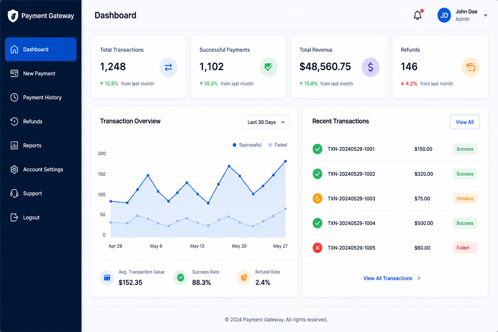

# Payment Gateway Documentation



## Table of Contents

- [Version Information](#version-information)
- [Overview](#overview)
- [Quick Start](#quick-start)
- [Intended Audience](#intended-audience)
- [API Reference](#api-reference)
- [Documentation Scope](#documentation-scope)
- [Documentation Set](#documentation-set)
- [Features](#features)
- [Tech Stack](#tech-stack)
- [Prerequisites](#prerequisites)
- [Environment Support](#environment-support)
- [Assumptions](#assumptions)
- [Installation](#installation)
- [Authentication](#authentication)
- [Supported Payment Methods](#supported-payment-methods)
- [Payment Flow](#payment-flow)
- [Architecture](#architecture)
- [Security Considerations](#security-considerations)
- [Error Handling](#error-handling)
- [Payment Statuses](#payment-statuses)
- [Webhook Events](#webhook-events)
- [FAQ](#faq)
- [Glossary](#glossary)
- [Known Limitations](#known-limitations)
- [Future Enhancements](#future-enhancements)
- [Project Structure](#project-structure)

## Version Information

| Item | Value |
|------|-------|
| Documentation Version | 1.0 |
| Application Version | 1.0 |
| Status | Active |
| Last Updated | June 2026 |

## Overview

The Payment Gateway Dashboard is a web application that simulates a modern payment management platform. It enables users to create payments, monitor transaction history, manage webhook events, configure application settings, and submit support requests through a centralized dashboard.

The application demonstrates a complete payment workflow using a clean and intuitive interface while following common payment gateway concepts such as payment processing, transaction tracking, webhook notifications, and secure authentication.

This repository contains a complete documentation set covering installation, application usage, API reference, technical implementation, troubleshooting, and release history.

## Quick Start

1. Clone the repository.
2. Install project dependencies.
3. Start the development server.
4. Sign in to the application.
5. Create a new payment.
6. View the transaction in Payment History.
7. Monitor webhook events and explore additional dashboard features.

## Intended Audience

This documentation is intended for:

- Developers
- Technical Writers
- QA Engineers
- Students
- Recruiters reviewing the project

## API Reference

Detailed API endpoints, request and response examples, authentication requirements, and webhook payloads are available in **API_DOCUMENTATION.md**.

## Documentation Scope

This README provides a high-level overview of the Payment Gateway Dashboard, including its features, architecture, installation requirements, payment workflow, and supporting documentation.

Detailed implementation and integration information is available in the accompanying documentation files.

## Documentation Set

| Document | Description |
|----------|-------------|
| README.md | Project overview and introduction |
| USER_GUIDE.md | End-user instructions for using the application |
| API_DOCUMENTATION.md | API endpoints, authentication, requests, and responses |
| TECHNICAL_OVERVIEW.md | System architecture and implementation details |
| INSTALLATION_GUIDE.md | Project setup and installation instructions |
| TROUBLESHOOTING_GUIDE.md | Common issues and recommended solutions |
| RELEASE_NOTES.md | Version history and feature updates |

## Features

- Dashboard with payment analytics and recent transactions
- Create and manage payment requests
- Payment History with search, filters, and CSV export
- View detailed payment information
- Webhook configuration and delivery monitoring
- Webhook event logs with payload details
- Support ticket submission and tracking
- FAQ section for common questions
- User profile management
- Application settings management
- Authentication (Sign In, Sign Up, Forgot Password, Reset Password)
- Local storage-based data persistence
- Responsive dashboard layout
- Clean and intuitive user interface

## Tech Stack

### Frontend

- React
- React Router
- JavaScript (ES6+)
- HTML5
- CSS3

### Libraries

- React Toastify
- React Icons
- Recharts

### Development Tools

- npm
- Visual Studio Code
- Git
- GitHub

## Prerequisites

Before running the project, ensure you have the following installed:

- Node.js (v18 or later)
- npm
- Git
- A modern web browser (Chrome, Edge, Firefox, or Safari)

## Environment Support

The application supports the following environments:

| Environment | Purpose |
|------------|---------|
| Development | Local development and testing |
| Production | Deployment-ready build |

## Assumptions

This project assumes that:

- Node.js and npm are installed.
- JavaScript is enabled in the browser.
- Local Storage is available.
- The application runs in a modern browser.
- Internet access is available for installing project dependencies.

## Installation

1. Clone the repository.

```bash
git clone https://github.com/your-username/payment-gateway.git
```

2. Navigate to the project directory.

```bash
cd payment-gateway
```

3. Install dependencies.

```bash
npm install
```

4. Start the development server.

```bash
npm start
```

5. Open the application in your browser.

```
http://localhost:3000
```
