USER-GUIDE

# Table of Contents

- [Overview](#overview)
- [Getting Started](#getting-started)
- [How to Use](#how-to-use)
- [Features](#features)
- [Common Tasks](#common-tasks)
- [Troubleshooting](#troubleshooting)
- [FAQ](#faq)

# Overview

PayFlow is a React-based payment gateway management application that simulates the complete payment lifecycle. It enables users to create and manage payments, monitor transactions, manage account information, and submit support requests through a clean and responsive interface.

This guide explains how to use the PayFlow application, including authentication, payment management, profile management, customer support, and frequently asked questions.

# Getting Started

## Login

The Login page allows registered users to securely access the PayFlow application.

### Fields

| Field | Description | Required |
|--------|-------------|----------|
| Email | Registered email address | Yes |
| Password | Account password | Yes |

### Buttons

| Button | Description |
|----------|-------------|
| Login | Authenticates the user and opens the Dashboard. |
| Sign Up | Opens the registration page for new users. |

### Steps

1. Enter your registered email address.
2. Enter your password.
3. Click **Login**.

### Result

If the credentials are valid, the Dashboard page is displayed.

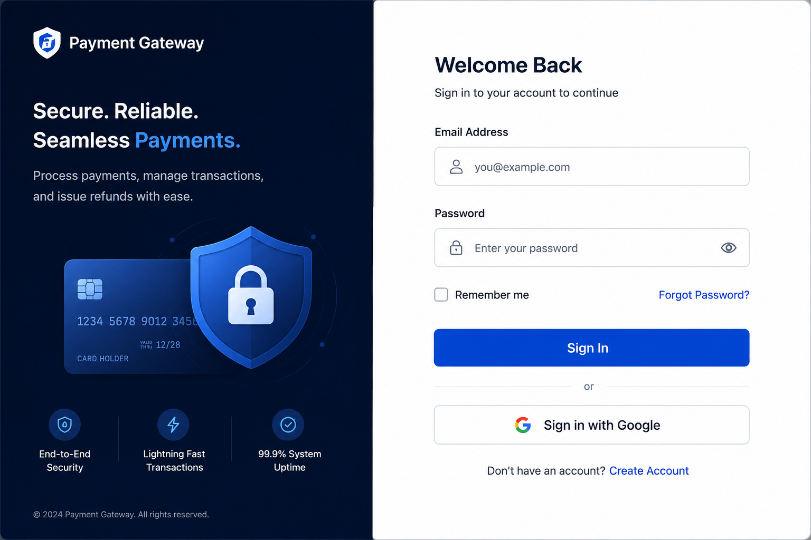

## Sign Up

The Sign Up page allows new users to create an account.

### Fields

| Field | Description | Required |
|--------|-------------|----------|
| Full Name | User's name | Yes |
| Email | Email address | Yes |
| Password | Account password | Yes |
| Confirm Password | Account password | Yes |

### Buttons

| Button | Description |
|----------|-------------|
| Create Account | Creates a new account. |
| Back to Login | Returns to the Login page. |

### Steps

1. Enter all required information.
2. Click **Create Account**.
3. Return to Login.
4. Sign in using the newly created account.

### Result

A new account is created successfully.


# How to Use

## Dashboard

The Dashboard provides an overview of payment activity.

### Available Information

- Total Payments
- Successful Payments
- Pending Payments
- Failed Payments
- Monthly Payment Chart
- Recent Payments
- Notifications

### Actions

- View recent payment details.
- Navigate to Payment History.
- Access other application modules.

### Result

Users can monitor payment activity from a single location.

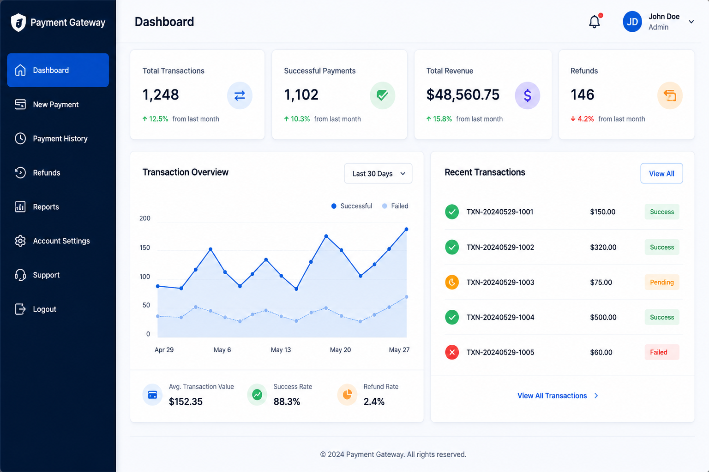

## Notifications

The notification panel displays recent payment and application updates.

### Steps

1. Click the notification bell.
2. Review the available notifications.
3. Close the notification panel.

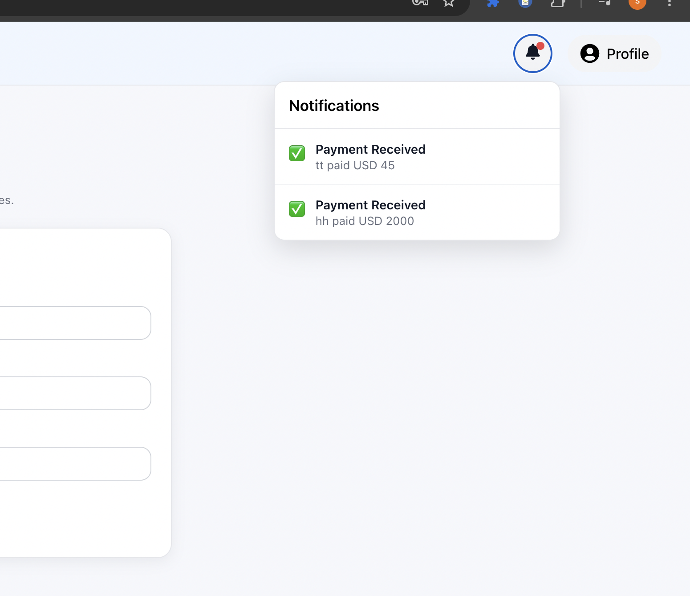

# Features

## Payment Management

The Payment Management feature allows users to create, view, search, filter, and export payment records.

### Create a New Payment

Allows users to create a payment transaction.

### Fields

| Field | Description | Required |
|--------|-------------|----------|
| Customer Name | Name of the customer | Yes |
| Payment ID | Payment ID of the transaction | Yes |
| Customer Email | Email address | Yes |
| Phone Number | Customer phone number | Yes |
| Amount | Payment amount | Yes |
| Currency | Payment currency | Yes |
| Payment Method | Selected payment method | Yes |
| Description | Payment description | No |

### Buttons

| Button | Description |
|----------|-------------|
| Create Payment | Creates a new payment. |
| Cancel | Returns to Dashboard. |

### Steps

1. Complete all required fields.
2. Verify the Payment Summary.
3. Click **Create Payment**.

### Result

The payment is created and the application redirects to the Payment Success page.

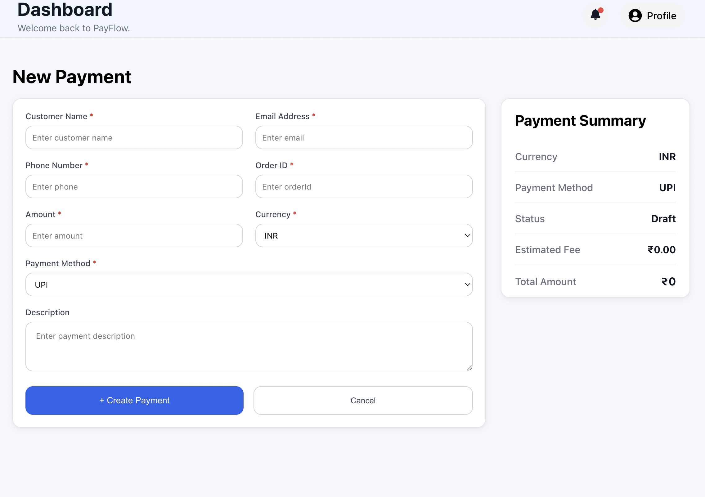

## Payment History

The Payment History page displays all created payments.

### Features

- Search
- Status Filter
- Export CSV
- Pagination
- Payment Details

### Table Columns

- Payment ID
- Customer
- Amount
- Currency
- Status
- Date
- Actions

### Result

Users can efficiently manage and review payment records.

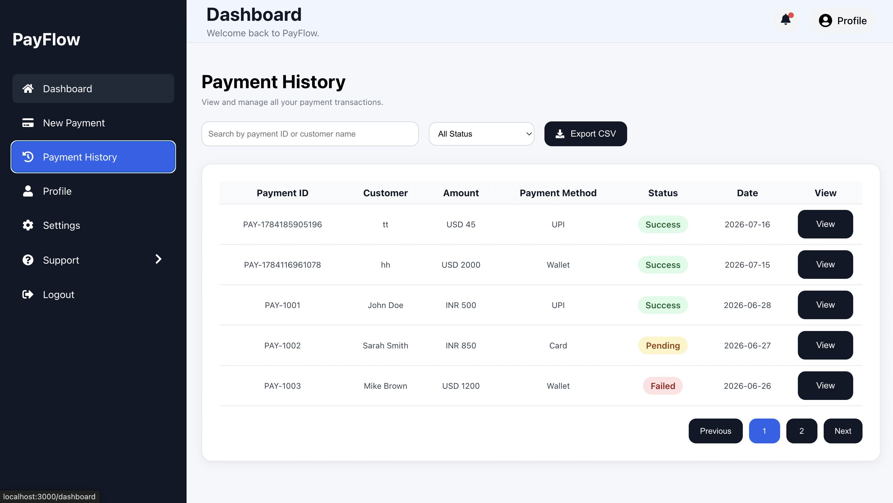

## Payment Details

The Payment Details view displays complete information about a selected payment.

### Information Displayed

- Payment ID
- Customer Details
- Amount
- Currency
- Payment Method
- Status
- Description
- Date

### Buttons

- Close
- Delete

### Result

Provides complete payment information without leaving the Payment History page.

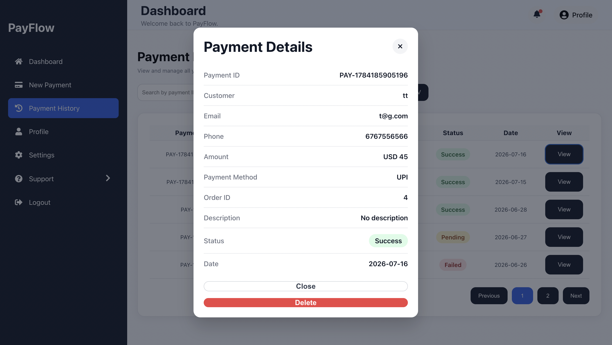

## Payment Success

The Payment Success page confirms successful payment creation.

### Information Displayed

- Payment ID
- Customer
- Amount
- Currency
- Status
- Date

### Buttons

- Create New Transaction
- View Payments

### Result

Users can immediately create another payment or review payment history.

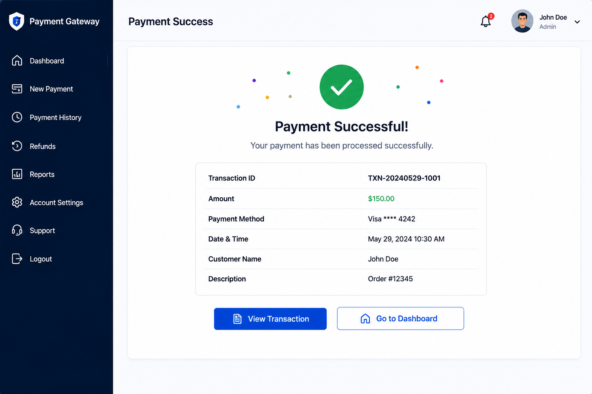

## Profile

The Profile page allows users to update their profile information.

### Fields

| Field | Description | Required | Editable |
|--------|-------------|----------|----------|
| Name | User's name | Yes | No |
| Email | Email address | Yes | No |
| Phone Number | User's phone number | Yes | Yes |
| Company | Company name | Yes | Yes |

### Buttons

- Save Profile
- Cancel

### Result

Profile information is updated successfully.

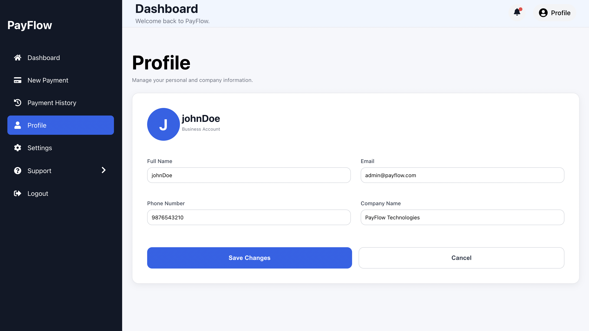

## Change Password

The Change Password page allows users to update their account password.

### Fields

| Field | Description | Required |
|--------|-------------|----------|
| Current Password | User's password | Yes |
| New Password | New password | Yes |
| Confirm Password | New password should match | Yes |

### Buttons

- Update Password

### Result

The account password is successfully updated.

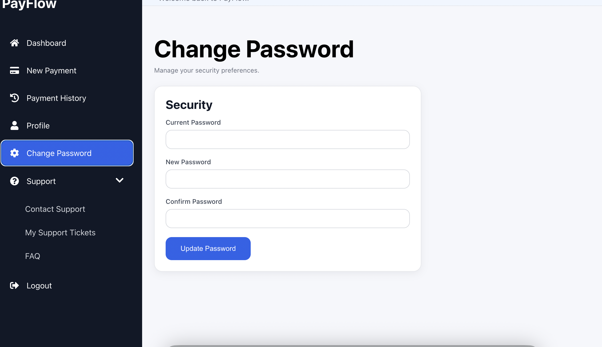

## Contact Support

The Contact Support page allows users to submit support requests.

### Fields

| Field | Description | Required | Editable |
|--------|-------------|----------|----------|
| Name | User's name | Yes | No |
| Email | User's email | Yes | No |
| Category | Category of request | Yes | Yes |
| Priority | Priority of request | Yes | Yes |
| Subject | Subject of request | Yes | Yes |
| Description | Description of request | Yes | Yes |
| Screenshot | Screenshot of request in image format | No | Yes |

### Buttons

- Submit Ticket

### Result

A support ticket is created successfully.

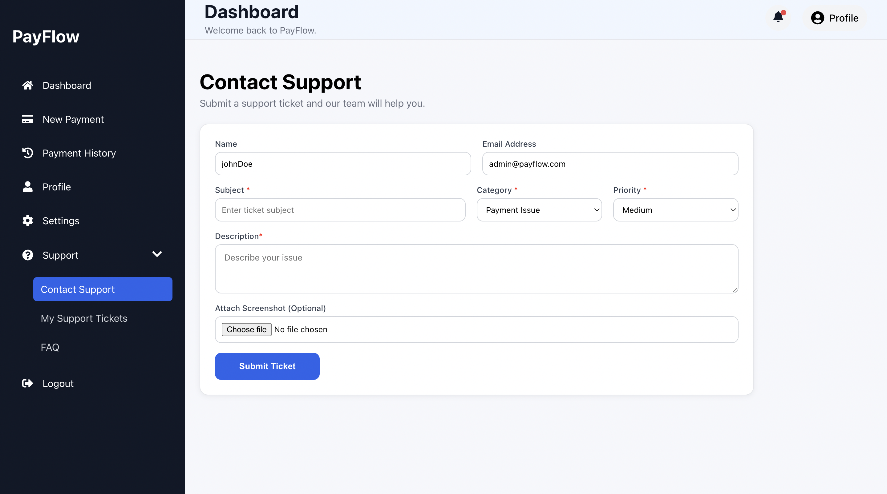

## Support Tickets

The Support Tickets page displays all submitted support tickets.

### Features

- Search
- Status Filter
- Pagination
- View Ticket
- Delete Ticket

### Table Columns

- Ticket ID
- Subject
- Priority
- Status
- Created Date

### Result

Users can manage all submitted support requests.

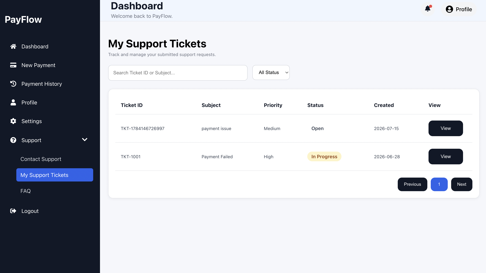

## Support Ticket Details

The Support Ticket Details view displays detailed information about a support ticket.

### Information Displayed

- Ticket ID
- Subject
- Category
- Priority
- Status
- Description
- Assigned To
- Attachment

### Buttons

- Close
- Delete

### Result

Users can review or remove an existing support ticket.

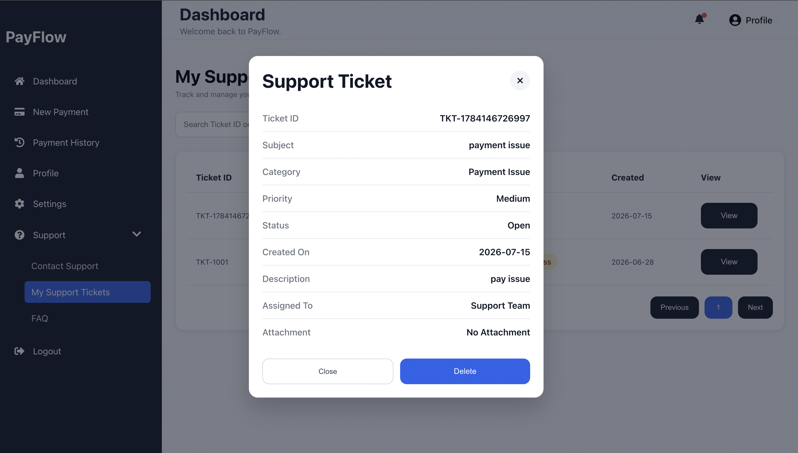

# Troubleshooting

## Issue

**Problem:** Application does not start.

**Cause:** Project dependencies have not been installed.

**Solution:**

Run:

```bash
npm install
```
Then start the application:
```
npm start
```

## Issue

**Problem:** Application does not start.

**Cause:** Project dependencies have not been installed.

**Solution:**

Run:

```bash
npm install
```
Then start the application:
```
npm start
```
## Issue

**Problem:** `npm install` fails.

**Cause:** Node.js may not be installed, the internet connection may be unavailable, or the npm cache may be corrupted.

**Solution:**

- Verify that Node.js is installed.
- Check your internet connection.
- Clear the npm cache if required.

```bash
npm cache clean --force
npm install
```

text-formatter-pro(5).zip
Zip Archive
Pasted markdown(20260906-180727).md
File
Yh dekh itni badi.. Kya change krega phle heading dede muje
# Troubleshooting

## Issue

**Problem:** Application does not start.

**Cause:** Project dependencies have not been installed.

**Solution:**

Run:

```bash
npm install
```
Then start the application:

npm start
n
## Issue

**Problem:** `npm install` fails.

**Cause:** Node.js may not be installed, the internet connection may be unavailable, or the npm cache may be corrupted.

**Solution:**

- Verify that Node.js is installed.
- Check your internet connection.
- Clear the npm cache if required.

```bash
npm cache clean --force
npm install
faq de
# FAQ

## Q

**How do I create a payment?**

### A

Go to **New Payment**, enter the required payment details, and submit the payment.

## Q

**Why can't I log in?**

### A

Verify your email address and password. If you do not have an account, create a new account using **Sign Up**.
